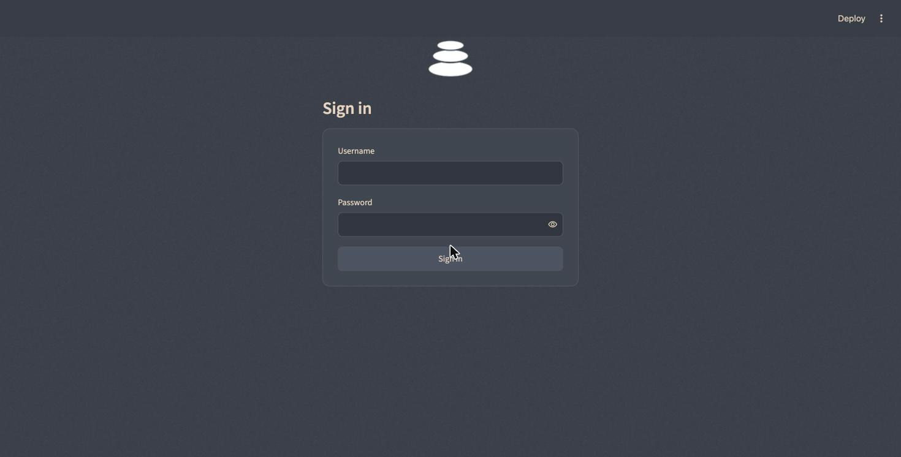
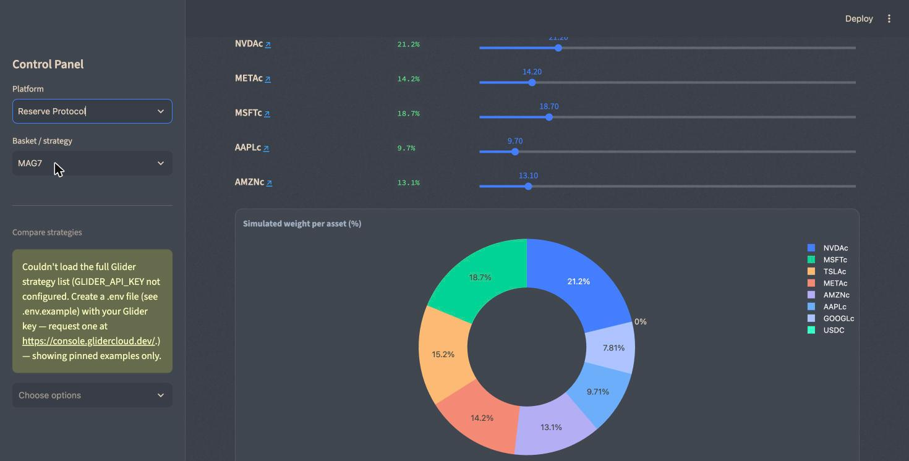
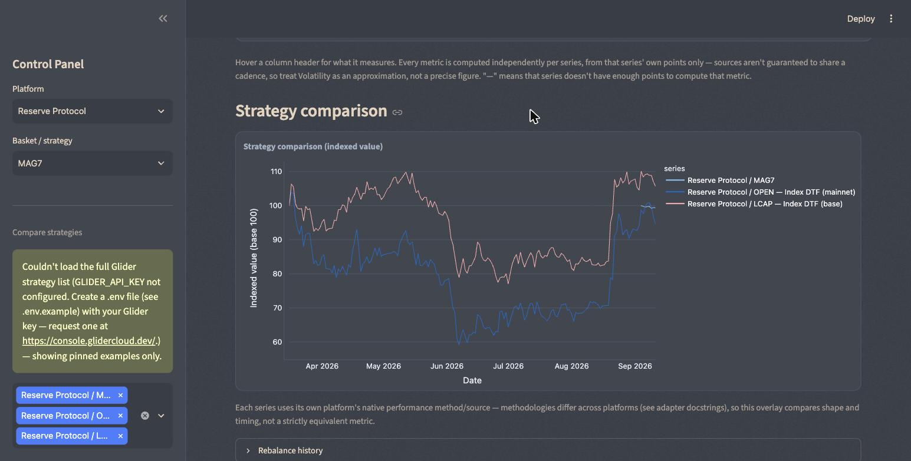

# BL008 — DTFs On-Chain Monitoring

Streamlit app that compares real on-chain rebalancing behavior across three
basket platforms — Glider, Reserve Protocol and QuantAMM/Balancer — side by
side.



## What it does

Lets you pick a platform and a basket, see its current allocation, and drag
sliders to simulate a different weighting against the platform's real
rebalance history and performance. You can open multiple weight tabs for
the same basket, browser-style, and every tab's simulated curve is overlaid
on the same performance chart, with a summary table (return, volatility,
max drawdown) per curve. A comparison view overlays several baskets' real
performance across platforms, alongside who decides each platform's
rebalances (governance, provider API, or an autonomous ML signal) and how
often. The app is read-only — it never writes to any platform, and it's
gated behind a single shared login.





## Running it locally

Requires Python 3.10+.

1. Create a virtualenv and install dependencies:

   ```bash
   python3 -m venv .venv
   source .venv/bin/activate
   pip install -r requirements.txt
   ```

2. Copy `.env.example` to `.env` and fill in `GLIDER_API_KEY`,
   `APP_USERNAME` and `APP_PASSWORD`:

   ```bash
   cp .env.example .env
   ```

   Request a Glider key at <https://console.glidercloud.dev/> — only the
   Glider platform needs one; Reserve and QuantAMM use public,
   unauthenticated sources, and Glider shows a contained error instead of
   breaking if it's missing. `APP_USERNAME`/`APP_PASSWORD` gate the whole
   app behind a single shared login; leaving either blank blocks every
   visitor with a setup message. Deploying to Streamlit Community Cloud?
   Set all three in the app's **Secrets** panel instead — no `.env` file
   gets deployed there.

3. Run:

   ```bash
   streamlit run app.py
   ```

## Configuration

| Variable | Required | Purpose |
|---|---|---|
| `GLIDER_API_KEY` | Only for the Glider platform | Auth for the Glider B2B API v2. |
| `APP_USERNAME` | Yes | Username for the shared login gate. |
| `APP_PASSWORD` | Yes | Password for the shared login gate. |

See `.env.example` for the exact keys.

## Layout

```
app.py                  # Streamlit entrypoint — login gate, platform selector, page
adapters/                # one module per platform, same function signatures
  glider.py
  reserve.py
  quantamm.py
  pricing.py             # historical asset prices (DefiLlama), used by the simulator
ui/
  theme.py               # dark theme CSS, footer, login/header branding, shared Plotly theme
public/                 # logos, favicon and background assets used by ui/theme.py
docs/
  rebalancing-simulator.md  # how the app behaves: data shapes, rules, gotchas
```

`docs/rebalancing-simulator.md` is the reference for how the app actually
behaves — adapter interface, per-platform data shapes, simulation rules, and
known gotchas. Read it before changing `app.py` or any adapter.
